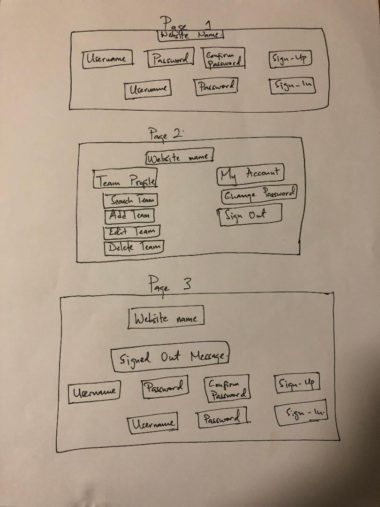

## General Assembly SEI Project 2 (Full-stack-project)

## Planning story
The goal of this project is to build a full stack application. The idea is to have a frontend where the user would be able to create an account using the authorization forms, get into the website and create, update, delete and see all created items within their account. The user should also not be able to log into their and be able CRUD in anyone else's account.

#### Breaking down the challange
With the frontend, I started by getting the authorization forms done, that way a new user would be able to create an account and sign in before doing anything with the teams resource. When that was complete, I moved on to creating the forms that would be used to CRUD the resource that had been built

## USER STORIES
- As a fan, I would like to be able to sign-up within a few clicks
- As a fan, I would like to be able to sign-in within a few clicks
- As a fan, I would like to be able to sign-out within a few clicks
- As a fan, I would like to be able to change-password within a few clicks
- As a fan, I want to be able to look up team's entire profile without clicking
  in too many places.
- As a fan, I would like to be able to add my teams by entering data
- As a fan, I would like to be able to edit any data for teams that I added
- As a fan, I would like to be able to delete any data for teams that I added
    by simply selecting and deleting with one button
- As a fan, I would like to see all my teams.

## TECHNOLOGY USED
- jQuery
- HTML
- Javascript
- Github
- HTML
- CSS

## LINKS

[Deployed BackEnd API](https://thebadlands.herokuapp.com/)

[BackEnd repo](https://github.com/mwwasswa/project_2_api)

[Deployed FrontEnd Client](https://mwwasswa.github.io/project_2_client/)

## WIREFRAME

## WOULD LIKE TO ADD
- I would like to build a joins table so that a user can compare different teams in the league
- I would like to see historical stats for the craeted teams, game won, games lost and whoever they played
- I would like to have teams profiles across multiple types of sports
